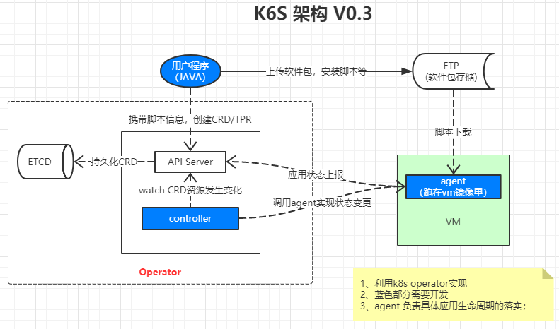

# k6s

k6s 是一个类似 k8s 架构的非容器 paas 平台解决方案，提供非容器应用的生命周期管理功能。

通过 operator 类似的模式实现，利用自定义 controller 操作 CRD/TPR，但是基础单元不是 pod，而是一个个 vm 上的非容器化应用。

## 项目定位

容器 paas 大家第一个会想到 k8s ，非容器 paas 呢？我们希望在不久的将来，大家第一个会想到 k6s!

现有的 terraform，cloudify 等项目都可以实现需求，但是我们觉得门槛有点高，对于简单paas场景来说不够简洁优雅，好的软件应该是简单的，或者用起来感觉是简单的，我们想实现一个“简单”的 paas.

考虑到很多企业在实施 paas 前已经有iaas平台(很多是基于openstack实现了)。这时候开发 paas 平台其实可以很轻松地调用已有 iaas 平台完成 iaas 资源的管理。所以 k6s 如果再把 vm 当作最小粒度来调度，当作 paas 前提，这种解决方案似乎就重了。这时候我们认为需要一个专注于 paas 本身逻辑的解决方案，不纠结于如何创建vm，如何调度vm，而是专注于在给定vm之后如何更好地将应用部署上去，管理好应用的生命周期。将 iaas 层资源的管理留给用户(当然我们会保留 k6s 操作 iaas 的接口，便于拓展，但这不是标配)。

## 项目架构

## 参与贡献

请先仔细阅读[Contributing](./CONTRIBUTING.md)

